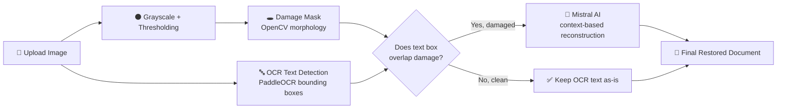
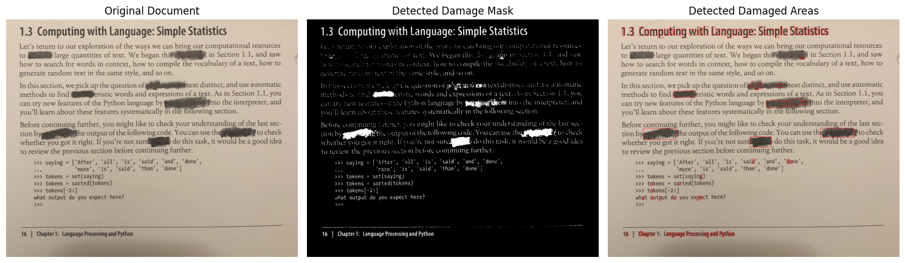
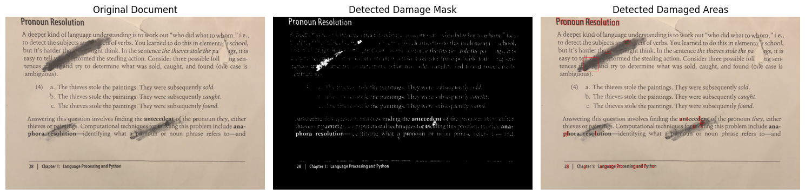
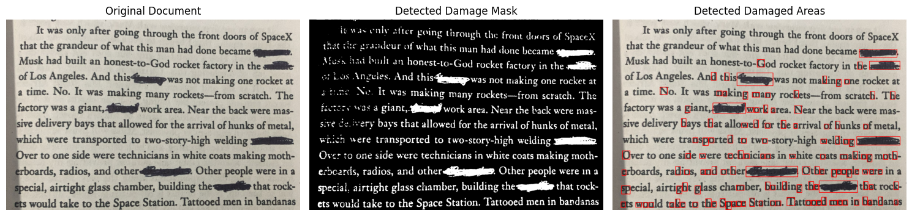
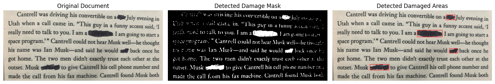
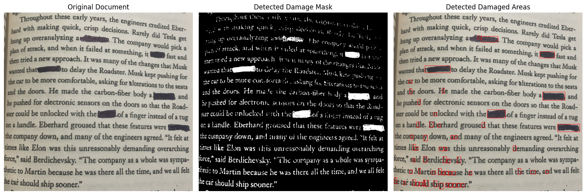

<div align="center">

# 🧩 DocRestore — AI Document Text Restoration

**Recovering readable text from burned, torn, and damaged documents using Computer Vision + OCR + LLM reasoning.**


</div>

---

## Table of Contents

- [What Is This?](#what-is-this)
- [Pipeline at a Glance](#pipeline-at-a-glance)
- [Why It's Hard](#why-its-hard)
- [Feature Breakdown](#feature-breakdown)
- [Tech Stack](#tech-stack)
- [Results Gallery](#results-gallery)
- [Getting Started](#getting-started)
- [Usage Walkthrough](#usage-walkthrough)
- [Repo Layout](#repo-layout)
- [Known Limitations](#known-limitations)
- [Roadmap](#roadmap)
- [Author](#author)

---

## What Is This?

Paper documents get damaged — burned corners, torn strips, ink bleed, blacked-out redactions. When that happens, OCR alone gives up: it either skips the region entirely or outputs garbage. **DocRestore** doesn't just extract text — it figures out *where* a document is damaged, isolates exactly which text was affected, and uses the surrounding sentence context to reconstruct what was probably there.

Think of it less as "OCR software" and more as **OCR + a forensic reasoning layer**.

> This is an academic/prototype build — the goal is to demonstrate the pipeline design, not to ship a production restoration tool.

---

## Pipeline at a Glance



Everything left of the diamond is pure Computer Vision / OCR. Everything right of it is where the LLM earns its keep — it only ever touches the lines flagged as damaged, using the clean lines around them as grounding context.

---

## Why It's Hard

| Challenge | Naive Approach | What This Pipeline Does Instead |
|---|---|---|
| Damage isn't labeled anywhere | Manually crop bad regions | Auto-generates a damage mask via thresholding + morphological ops |
| OCR fails silently on damage | Trust whatever OCR returns | Cross-checks every OCR box against the damage mask before trusting it |
| LLMs hallucinate freely | Ask the LLM to "fix the document" | Only feeds *damaged* lines to the LLM, anchored by real surrounding text |
| No ground truth to check against | Assume the output is correct | Flags reconstructed text as a *prediction*, not a guarantee |

---

## Feature Breakdown

- 📤 Upload any damaged document image directly in the browser
- 🧪 Automatic damage-region detection (burns, tears, blackout marks)
- 🗺️ Visual damage mask generated on the fly
- 🔎 OCR-based text + bounding box extraction (PaddleOCR)
- 🎯 Damage-to-text overlap matching, so only affected lines get flagged
- 🧠 Context-aware reconstruction of damaged lines via Mistral AI
- 🖥️ Clean three-panel comparison: original → mask → detected damage

---

## Tech Stack

<table>
<tr><td><b>Language</b></td><td>Python</td></tr>
<tr><td><b>Interface</b></td><td>Streamlit</td></tr>
<tr><td><b>Computer Vision</b></td><td>OpenCV (grayscale thresholding, morphological ops)</td></tr>
<tr><td><b>OCR Engine</b></td><td>PaddleOCR / PaddlePaddle</td></tr>
<tr><td><b>Reasoning Layer</b></td><td>LangChain + Mistral AI (<code>mistral-large-latest</code>)</td></tr>
</table>

---

## Results Gallery

Each row below is one damaged page run through the pipeline: **original photo → damage mask → damaged regions highlighted.**

<table>
<tr>
<td align="center"><b>Simple Statistics</b></td>
</tr>
<tr>
<td></td>
</tr>
<tr>
<td align="center"><b>Pronoun Resolution</b></td>
</tr>
<tr>
<td></td>
</tr>
<tr>
<td align="center"><b>SpaceX Factory Passage</b></td>
</tr>
<tr>
<td></td>
</tr>
<tr>
<td align="center"><b>Cantrell Call Passage</b></td>
</tr>
<tr>
<td></td>
</tr>
<tr>
<td align="center"><b>Tesla Roadster Passage</b></td>
</tr>
<tr>
<td></td>
</tr>
<tr>
<td align="center"><b>Third Launch Passage</b></td>
</tr>
<tr>
<td></td>
</tr>
</table>

---

## Getting Started

<details>
<summary><b>1. Clone the repo</b></summary>

```bash
git clone https://github.com/AbdulRehmanMirza/AI-Document-Text-Restoration.git
cd AI-Document-Text-Restoration
```
</details>

<details>
<summary><b>2. Set up a virtual environment</b></summary>

**Windows**
```bash
python -m venv .venv
.venv\Scripts\activate
```

**macOS / Linux**
```bash
python3 -m venv .venv
source .venv/bin/activate
```
</details>

<details>
<summary><b>3. Install dependencies</b></summary>

```bash
pip install streamlit opencv-python numpy matplotlib paddleocr paddlepaddle langchain-mistralai
```

> ⚠️ If `paddlepaddle` fails to install, grab the build matching your OS/CPU/GPU from the [official PaddlePaddle install guide](https://www.paddlepaddle.org.cn/en/install/quick).
</details>

<details>
<summary><b>4. Set your Mistral API key</b></summary>

**Windows PowerShell**
```powershell
$env:MISTRAL_API_KEY="your_api_key_here"
```

**macOS / Linux**
```bash
export MISTRAL_API_KEY="your_api_key_here"
```
</details>

<details>
<summary><b>5. Launch the app</b></summary>

```bash
streamlit run app.py
```

Opens at → `http://localhost:8501`
</details>

---

## Usage Walkthrough

1. Launch the app and upload a photo of a damaged document.
2. The pipeline runs damage detection and OCR automatically.
3. Inspect the generated damage mask to see what was flagged.
4. Review the highlighted damaged regions overlaid on the original.
5. Read the reconstructed text where the LLM filled in the gaps.

---

## Repo Layout

```
AI-Document-Text-Restoration/
│
├── app.py                 → Streamlit app + full pipeline logic
├── README.md
├── gitignore.txt
└── screenshots/           → Sample runs from the original prototype
```

---

## Known Limitations

- Restoration quality is only as good as the input photo — blur, glare, and skew all hurt OCR accuracy.
- Damage detection is threshold-based, so it can flag false positives on naturally dark print or shadows.
- Reconstructed text is a **plausible guess**, not a verified match to the original content.
- Requires a valid Mistral API key — there's no offline fallback for the reconstruction step.

---

## Roadmap

- [ ] Ship a `requirements.txt` for one-line installs
- [ ] Support multi-page PDF uploads, not just single images
- [ ] Auto-deskew / auto-rotate before OCR
- [ ] Downloadable restored-text export (.txt / .docx)
- [ ] Confidence scoring on reconstructed spans
- [ ] Manual damage-region selection as a fallback

---

## Author

**Abdul Rehman Mirza**
Artificial Intelligence Student

